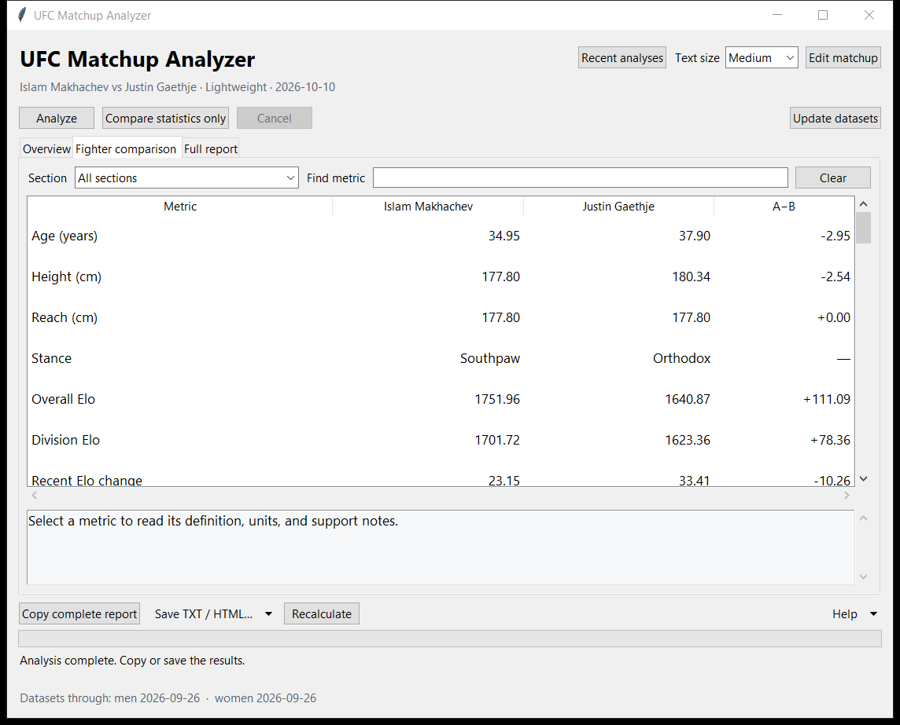
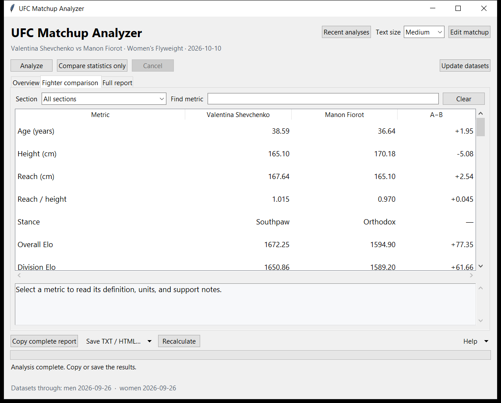

# UFC Matchup Analyzer

A small Windows app for analyzing one men's or women's UFC matchup. Enter the division, date and fighters, then get a detailed side-by-side comparison, win probabilities and data-quality information. Analysis runs locally using fight-history datasets.

**Source-only development preview:** this repository contains the code, documentation, model workflows and tests. It does **not** contain the prediction datasets, bundled Python runtime or portable Windows download. A new clone cannot run predictions until all matching data prerequisites are supplied. There is no public dataset download or supported from-scratch bootstrap yet.

Dataset redistribution rights are unresolved. The local bundled app and dataset archive are not being published. The portable candidate also has outstanding clean-machine and actual display-scaling checks. See [dataset provenance](DATA_NOTICE.md) and [release verification](RELEASE_VERIFICATION.md); publishing source does not clear those release gates.

## Run from source

Source operation requires **64-bit Python 3.14.7**, the locked libraries in `requirements.lock`, a writable folder, and every data file listed in `dataset_manifest.json`. The project's MIT code license does not grant rights to third-party data. The commands below apply only if you already have a matching dataset archive you are entitled to use:

```bat
setup.bat --dataset-archive "C:\Downloads\ufc-matchup-analyzer-datasets-v0.3.0.zip"
.venv\Scripts\python.exe analyzer_gui.py
```

Setup creates one local environment and checks dependencies and data. It does not supply or grant permission to obtain the missing snapshot. See [CLI and manual setup](docs/CLI.md) for prediction, comparison, maintenance and macOS/Linux instructions. Dataset-free contributor checks are described in [contributing](CONTRIBUTING.md); these are source checks rather than complete model validation.

## Start the local portable Windows candidate

These instructions describe the privately prepared candidate. The ZIP is not available as a public GitHub release:

1. Obtain your local **ufc-matchup-analyzer-v0.3.0-windows.zip**.
2. Right-click the ZIP and choose **Extract All**. Use a writable folder, such as Documents.
3. Open the extracted **UFC Matchup Analyzer** folder.
4. Double-click **UFC Matchup Analyzer.exe**.

That is the complete setup. The ZIP includes Python, all runtime libraries, the interface and all 15 required datasets. No separate installation, administrator access, terminal, Git, GPU, account or API key is needed. Predictions work without internet. Keep the `app` and `runtime` folders beside the executable; move the complete folder when relocating it.

The initial portable release targets **Windows 10/11 x64**, subject to the checks in the verification report. GitHub's automatically generated Source code download is for developers and does **not** include the runtime or datasets.

## Analyze a matchup

Choose a labelled men's or women's division. The correct model is selected automatically. The date defaults to today; enter **YYYY-MM-DD**, such as `2026-10-10`.

Type at least two characters: suggestions appear automatically. Use arrow keys and Enter, or click a fighter. Matching ignores capitalization and accents. Misspellings produce credible close matches for you to select; unrelated text produces no match. The app never substitutes someone silently. Duplicate names require choosing the correct identity. Women's identities that the existing engine cannot safely distinguish are rejected. **Swap** exchanges the two fighters. Men's and women's selections are remembered separately.

Use **Today**, the calendar, or type the date. The app shows eligible fight counts, the latest included fight, and selected-division experience before you start. A warning and confirmation allow hypothetical matchups with no eligible or selected-division history; this does not create additional data.

Click **Analyze** and allow a few minutes. Dated comparison statistics appear before prediction training finishes. Progress identifies actual preparation, cross-validation and fitting stages; **Cancel** stops analysis safely. **Compare statistics only** prepares the comparison without fitting prediction models. No probability, winner or model reliability is generated in this mode. One computation or dataset operation can run per app folder at a time.

**Overview** presents probabilities, coverage warnings and twelve key statistics. **Fighter comparison** groups every available metric; choose a section, filter metric names, or select a row to read its definition and support notes. **Full report** contains the complete text and model details. Filtering does not remove information from exports. Inputs collapse after completion; **Edit matchup** opens them again. Text size and window size are remembered.

These examples are hypothetical matchups, not an event schedule:

| Field | Men's example | Women's example |
|---|---|---|
| Division | Men — Lightweight | Women — Flyweight |
| Fight date | 2026-10-10 | 2026-10-10 |
| Fighter A | Islam Makhachev | Valentina Shevchenko |
| Fighter B | Justin Gaethje | Manon Fiorot |

The included snapshot produces approximately **82.3% / 17.7%** for the men's example and **48.6% / 51.4%** for the women's example. Results can change after dataset or algorithm updates.





## Copy and save

**Copy complete report** copies the entire displayed analysis. Select text in Full report and press Ctrl+C to copy a portion. **Save TXT / HTML…** lets you choose a text or HTML report, then opens a standard Save dialog with `Fighter A vs Fighter B.txt` or `.html` prefilled. HTML includes formatted tables and complete model notes, opens offline, and can be printed from a browser. Exports use UTF-8, including accented names. Statistics-only exports have a clearly labelled filename.

Changing input fields does not alter an existing result; a banner identifies a previous matchup. Copy and Save refer to the displayed report, including clearly labelled pending, failed or cancelled comparisons. Keyboard: **Ctrl+Enter** analyzes; **Ctrl+Shift+C** copies the report; **Ctrl+S** saves; **Ctrl+F** finds a metric; **Ctrl+Plus/Minus** changes text size; Tab moves between controls.

## Recent analyses and faster repeat requests

**Recent analyses** keeps up to 50 completed predictions/statistics comparisons, capped at 50 MB, inside the app folder. Open or delete entries, or clear all history. A matching valid request automatically reopens its result with the original generation time and a reuse label. **Recalculate** bypasses saved-result reuse. The key includes fighter identities/order, division, dates/cutoff, calculation settings, dataset contents, implementation and runtime versions. Reversed matchups are computed separately.

Dataset changes or a new app version can make saved results outdated. They remain viewable, but cannot be reused for a current computation. A restored dataset can make an otherwise matching result valid again. Disable **Help → Keep recent analyses and reuse valid results** to stop new storage and reuse; existing entries remain until you clear them. Cancelled jobs and failed predictions are not saved as completed analyses. You can read and export older results while another operation runs; **Open new result** appears when the new analysis is ready.

## Update datasets

Click **Update datasets** while connected to the internet. One click updates both models: download into staging → audit completed fights → rebuild changed features → validate → install successful changes. The app reports added-fight counts and freshness dates. With no changes it reports **Already up to date**.

Failures preserve your installed datasets. Do not move or delete the app folder during an operation. Updates can be cancelled before installation starts; the commit finishes or recovers safely. Interrupted transactions are checked at the next launch before analysis is enabled.

**Help → Restore previous datasets** undoes the latest successful update or rebuild after confirmation. The app retains its latest recoverable backup and bounds older logs. **Help → Rebuild local features** uses local inputs without downloading fight data. **Help → Check installation** checks components, hashes and readiness. **Help → Open diagnostics** opens the relevant log.

Updating fight data rebuilds features. Predictions train the selected algorithm locally for the requested date. Algorithm changes arrive through a new app release. See [maintenance](docs/MAINTENANCE.md).

## Understand the results

The report compares **A** and **B** in aligned tables: physical attributes, overall/division **Elo**, opponent strength, UFC experience, striking, grappling, recent form, activity and available win/loss methods. Men's advanced comparison also includes refined opponent ratings, round experience, layoffs and division movement; women's includes opponent-Elo-weighted performance. Bayesian rate estimates and attempt counts explain how sparse histories are smoothed. Model details show men's raw/calibrated estimates or women's component probabilities, ensemble weights, disagreement and reliability factors.

**A − B** is the numerical difference, not a verdict on who is better. Percentage differences use **percentage points (pp)**. **N/A** means unavailable; zero remains zero. Elo is an internal calculated rating starting at 1500, not an official ranking. Read the explanations beneath the comparison for metric definitions and differing history windows.

Scroll down to see the complete report. Tables keep their columns aligned when you resize the window; use the horizontal scrollbar for wider sections. Copy and Save include **every section**, even those currently outside the visible area. Open saved TXT files in a monospace font for aligned columns.

Probabilities are estimates, not guaranteed outcomes. Men's confidence and women's reliability follow their existing model policies. Reliability describes stability of the probability, rather than certainty that a fighter will win. Read missing-history and missing-data warnings.

Historical fight statistics exclude the selected fight date and later fights; physical measurements may reflect newer profile corrections. Future matchups use eligible data available in the installed snapshot. The included snapshot reaches **2026-09-26**; the footer shows current dates after updates. Models cannot capture every injury, camp change or unrecorded circumstance. See [model notes](docs/MODELS.md) for methodology and leakage checks.

Typical observed analysis times are about **1–4 minutes** on the test computer. If the displayed analysis already contains statistics for the same fighters, order, division and date, **Compare statistics only** opens its Fighter comparison tab immediately. The prediction, timestamp, Copy and Save remain attached to that existing report; no datasets are reloaded and no extra history entry is created. Use **Recalculate** to request fresh computation. Changed matchups or results marked outdated follow the normal preparation workflow.

Fresh statistics-only comparisons still prepare advanced features: men's preparation can take about as long as a full prediction, while women's comparison avoids the longer cross-validation stage. Matching saved results loaded for a new calculation avoid preparation and training but still verify dataset contents. The portable package simplifies installation. Measured package sizes, memory, timings and limitations are in [release verification](RELEASE_VERIFICATION.md). Keep at least **1 GB free** for staging and backups; maintenance checks space before proceeding.

See [troubleshooting](docs/TROUBLESHOOTING.md), [CLI/manual source setup](docs/CLI.md), [contributing](CONTRIBUTING.md), and [portable build instructions](docs/BUILDING.md). macOS/Linux source operation is not presented as verified portable support.

Project code is MIT licensed. [Dataset rights](DATA_NOTICE.md) and [third-party licenses](THIRD_PARTY.md) are separate. This independent project is not endorsed by UFC or UFCStats.
